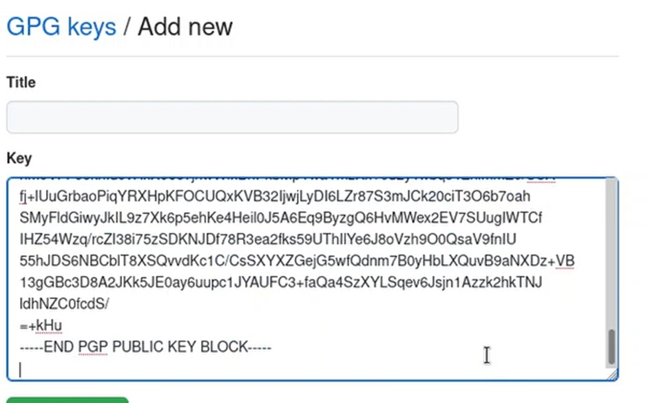

---
## Front matter
title: "Отчёт по лабораторной работе №2"
subtitle: "Управление версиями"
author: "Гайсина Алина Ринатовна"

## Generic otions
lang: ru-RU
toc-title: "Содержание"

## Bibliography
bibliography: bib/cite.bib
csl: pandoc/csl/gost-r-7-0-5-2008-numeric.csl

## Pdf output format
toc: true # Table of contents
toc-depth: 2
lof: true # List of figures
lot: true # List of tables
fontsize: 12pt
linestretch: 1.5
papersize: a4
documentclass: scrreprt
## I18n polyglossia
polyglossia-lang:
  name: russian
  options:
	- spelling=modern
	- babelshorthands=true
polyglossia-otherlangs:
  name: english
## I18n babel
babel-lang: russian
babel-otherlangs: english
## Fonts
mainfont: PT Serif
romanfont: PT Serif
sansfont: PT Sans
monofont: PT Mono
mainfontoptions: Ligatures=TeX
romanfontoptions: Ligatures=TeX
sansfontoptions: Ligatures=TeX,Scale=MatchLowercase
monofontoptions: Scale=MatchLowercase,Scale=0.9
## Biblatex
biblatex: true
biblio-style: "gost-numeric"
biblatexoptions:
  - parentracker=true
  - backend=biber
  - hyperref=auto
  - language=auto
  - autolang=other*
  - citestyle=gost-numeric
## Pandoc-crossref LaTeX customization
figureTitle: "рис."
tableTitle: "Таблица"
listingTitle: "Листинг"
lofTitle: "Список иллюстраций"
lotTitle: "Список таблиц"
lolTitle: "Листинги"
## Misc options
indent: true
header-includes:
  - \usepackage{indentfirst}
  - \usepackage{float} # keep figures where there are in the text
  - \floatplacement{figure}{H} # keep figures where there are in the text
---

## Цель работы:

- Изучить идеологию и применение средств контроля версий.
- Освоить умения по работе с git.

---

## Задание

Выполнить отчёт к предыдущей лабораторной работе.

# Ход работы

**1.** Создала учетную запись на GitHub.

**2.** Вручную установила программное обеспечение git-flow.(рис.[-@fig:001])

{ #fig:001 width=70% }

**3.** Установка gh. (рис.[-@fig:002])

{ #fig:002 width=70% }

**4.** Задала имя и email владельца репозитория. (рис.[-@fig:003])

{ #fig:003 width=70% }

**5.** Настроила utf-8 в выводе сообщений git. (рис.[-@fig:004])

{ #fig:004 width=70% }

**6.** Настроила верификацию и подписание коммитов git и задала имя
начальной ветки (master). (рис.[-@fig:005])

{ #fig:005 width=70% }

**7.** Создание ключа ssh. (рис.[-@fig:006;-@fig:007])

{ #fig:006 width=70% }

{ #fig:007 width=70% }

**8.** Создала ключ pgp и добавила его в GitHub. (рис.[-@fig:008;-@fig:009;-@fig:010;-@fig:011])

{ #fig:008 width=70% }

{ #fig:009 width=70% }

{ #fig:010 width=70% }

{ #fig:011 width=70% }

**9.** Настроила автоматические подписи коммитов git. (рис.[-@fig:012])

{ #fig:012 width=70% }

**10.** Настроила gh. (рис.[-@fig:013])

{ #fig:013 width=70% }

**11.** Создала репозиторий курса на основе шаблона. (рис.[-@fig:014;-@fig:015;-@fig:016])

{ #fig:014 width=70% }

{ #fig:015 width=70% }

{ #fig:016 width=70% }

**12.** Настроила каталоги курса. (рис.[-@fig:017;-@fig:018;-@fig:019])

{ #fig:017 width=70% }

{ #fig:018 width=70% }

{ #fig:019 width=70% }

# Выводы

Изучила идеологию и применение средств контроля версий и освоила уменияпо работе с git.

# Контрольные вопросы

1. Что такое системы контроля версий (VCS) и для решения каких задач они предназначаются?
- Система контроля версий (VCS) - программное обеспечение для облегчения работы с изменяющейся информацией. Система управления версиями позволяет хранить несколько версий одного и того же документа, при необходимости возвращаться к более ранним версиям, определять, кто и когда сделал то или иное изменение, и многое другое.
Такие системы наиболее широко используются при разработке программного обеспечения для хранения исходных кодов разрабатываемой программы. Однако они могут с успехом применяться и в других областях, в которых ведётся работа с большим количеством непрерывно изменяющихся электронных документов.
2. Объясните следующие понятия VCS и их отношения: хранилище, commit, история, рабочая копия.
- Хранилище – репозиторий - место хранения всех версий и служебной информации.
- Commit - это команда для записи индексированных изменений в репозиторий.
- История – место, где сохраняются все коммиты, по которым можно посмотреть данные о коммитах.
- Рабочая копия – текущее состояние файлов проекта, основанное на версии, загруженной из хранилища.
3. Что представляют собой и чем отличаются централизованные и децентрализованные VCS? Приведите примеры VCS каждого вида
- Централизованные системы – это системы, в которых одно основное хранилище всего проекта, и каждый пользователь копирует необходимые ему файлы, изменяет и вставляет обратно. Пример – Subversion.
- Децентрализованные системы – система, в которой каждый пользователь имеет свой вариант репозитория и есть возможность добавлять и забирать изменения из репозиториев. Пример – Git.

4. . Опишите действия с VCS при единоличной работе с хранилищем.
- В рабочей копии, которую исправляет человек, появляются правки, которые отправляются в хранилище на каждом из этапов. То есть в правки в рабочей копии появляются, только если человек делает их (отправляет их на сервер) и никак по-другому .
5. Опишите порядок работы с общим хранилищем VCS.
- Если хранилище общее, то в рабочую копию каждого, кто работает над проектом, приходят изменения, отправленные на сервер одним из команды. Рабочая правка каждого может изменяться вне зависимости от того, делает ли конкретный человек правки или нет.
6. Каковы основные задачи, решаемые инструментальным средством git?
- У Git две основных задачи: первая — хранить информацию обо всех изменениях в вашем коде, начиная с самой первой строчки, а вторая — обеспечение удобства командной работы над кодом.
7. Назовите и дайте краткую характеристику командам git.
- создание основного дерева репозитория: git init
- получение обновлений (изменений) текущего дерева из центрального репозитория: git pull
- отправка всех произведённых изменений локального дерева в центральный репозиторий: git push
- просмотр списка изменённых файлов в текущей директории: git status
- просмотр текущих изменения: git diff
- сохранение текущих изменений: – добавить все изменённые и/или созданные файлы и/или каталоги: git add .
- добавить конкретные изменённые и/или созданные файлы и/или каталоги: git add
- удалить файл и/или каталог из индекса репозитория (при этом файл и/или каталог остаётся в локальной директории): git rm имена_файлов
- сохранить все добавленные изменения и все изменённые файлы: git commit -am 'Описание коммита'
- сохранить добавленные изменения с внесением комментария через встроенный редактор: git commit
- создание новой ветки, базирующейся на текущей: git checkout -b имя_ветки
- переключение на некоторую ветку: git checkout имя_ветки (при переключении на ветку, которой ещё нет в локальном репозитории, она будет создана и связана с удалённой)
- отправка изменений конкретной ветки в центральный репозиторий: 1 git push origin имя_ветки
- слияние ветки с текущим деревом: 1 git merge —no-ff имя_ветки
- удаление локальной уже слитой с основным деревом ветки: git branch -d имя_ветки
- принудительное удаление локальной ветки: git branch -D имя_ветки
- удаление ветки с центрального репозитория: git push origin :имя_ветки

8. Приведите примеры использования при работе с локальным и удалённым    репозиториями.
- Работа с удаленным репозиторием: git remote – просмотр списка настроенных удаленных репозиториев.

- Работа с локальным репозиторием: git status - выводит информацию обо всех изменениях, внесенных в дерево директорий проекта по сравнению с последним коммитом рабочей ветки
9. Что такое и зачем могут быть нужны ветви (branches)?
Что такое и зачем могут быть нужны ветви (branches)?
- Ветка (англ. branch) — это последовательность коммитов, в которой ведётся параллельная разработка какого-либо функционала. Ветки нужны, чтобы несколько программистов могли вести работу над одним и тем же проектом или даже файлом одновременно, при этом не мешая друг другу. Кроме того, ветки используются для тестирования экспериментальных функций: чтобы не повредить основному проекту, создается новая ветка специально для экспериментов.
10. Как и зачем можно игнорировать некоторые файлы при commit?
- Игнорируемые файлы — это, как правило, артефакты сборки и файлы,       генерируемые машиной из исходных файлов в вашем репозитории, либо файлы, которые по какой-либо иной причине не должны попадать в коммиты. В Git нет специальной команды для указания игнорируемых файлов: вместо этого необходимо вручную отредактировать файл . Временно игнорировать изменения в файле можно командой git update-index-assumeunchanged<file>

