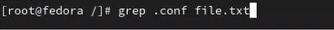
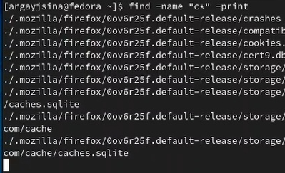
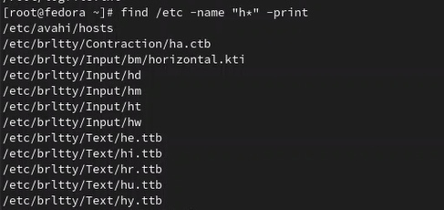
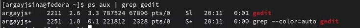
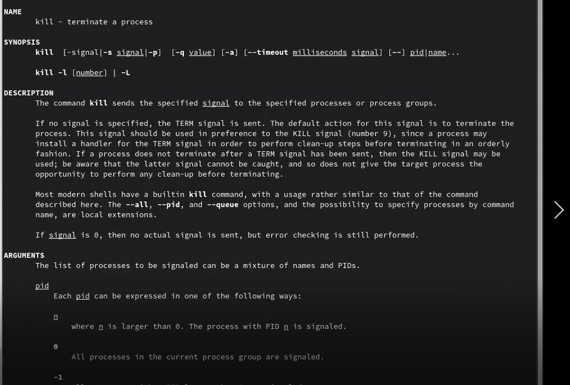
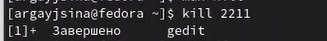
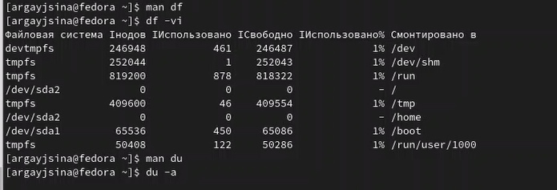

---
## Front matter
title: "Отчёт по лабораторной работе №6"
subtitle: "Поиск файлов. Перенаправление ввода-вывода. Просмотр запущенных процессов"
author: "Гайсина Алина Ринатовна"

## Generic otions
lang: ru-RU
toc-title: "Содержание"

## Bibliography
bibliography: bib/cite.bib
csl: pandoc/csl/gost-r-7-0-5-2008-numeric.csl

## Pdf output format
toc: true # Table of contents
toc-depth: 2
lof: true # List of figures
lot: true # List of tables
fontsize: 12pt
linestretch: 1.5
papersize: a4
documentclass: scrreprt
## I18n polyglossia
polyglossia-lang:
  name: russian
  options:
	- spelling=modern
	- babelshorthands=true
polyglossia-otherlangs:
  name: english
## I18n babel
babel-lang: russian
babel-otherlangs: english
## Fonts
mainfont: PT Serif
romanfont: PT Serif
sansfont: PT Sans
monofont: PT Mono
mainfontoptions: Ligatures=TeX
romanfontoptions: Ligatures=TeX
sansfontoptions: Ligatures=TeX,Scale=MatchLowercase
monofontoptions: Scale=MatchLowercase,Scale=0.9
## Biblatex
biblatex: true
biblio-style: "gost-numeric"
biblatexoptions:
  - parentracker=true
  - backend=biber
  - hyperref=auto
  - language=auto
  - autolang=other*
  - citestyle=gost-numeric
## Pandoc-crossref LaTeX customization
figureTitle: "Рис."
tableTitle: "Таблица"
listingTitle: "Листинг"
lofTitle: "Список иллюстраций"
lotTitle: "Список таблиц"
lolTitle: "Листинги"
## Misc options
indent: true
header-includes:
  - \usepackage{indentfirst}
  - \usepackage{float} # keep figures where there are in the text
  - \floatplacement{figure}{H} # keep figures where there are in the text
---

# Цель работы


Ознакомление с инструментами поиска файлов и фильтрации текстовых данных. Приобретение практических навыков: по управлению процессами (и заданиями), по проверке использования диска и обслуживанию файловых систем.

# Задания

1. Осуществите вход в систему, используя соответствующее имя пользователя.
2. Запишите в файл *file.txt* названия файлов, содержащихся в каталоге */etc*. Допишите в этот же файл названия файлов, содержащихся в вашем домашнем каталоге.
3. Выведите имена всех файлов из *file.txt*, имеющих расширение *.conf*, после чего
запишите их в новый текстовой файл *conf.txt*.
4. Определите, какие файлы в вашем домашнем каталоге имеют имена, начинавшиеся
с символа *c*? Предложите несколько вариантов, как это сделать.
5. Выведите на экран (по странично) имена файлов из каталога */etc*, начинающиеся
с символа *h*.
6. Запустите в фоновом режиме процесс, который будет записывать в файл *~/logfile*
файлы, имена которых начинаются с *log*.
7. Удалите файл *~/logfile*.
8. Запустите из консоли в фоновом режиме редактор *gedit*.
9. Определите идентификатор процесса *gedit*, используя команду *ps*, конвейер и фильтр
*grep*. Как ещё можно определить идентификатор процесса?
10. Прочтите справку (man) команды *kill*, после чего используйте её для завершения
процесса *gedit*.
11. Выполните команды *df* и *du*, предварительно получив более подробную информацию
об этих командах, с помощью команды *man*.
12. Воспользовавшись справкой команды *find*, выведите имена всех директорий, имеющихся в вашем домашнем каталоге.


# Ход работы

**1.** Вошла в систему.

**2.** Поднялась в корневой каталог и, воспользовавшись командой *ls* и перенапралением вывода, записала в *file.txt* названия всех файлов, содержащихся в каталоге */etc*. Затем я дописала в этом же файле названия файлов, содержащихся в моем домашнем каталоге.(рис. [-@fig:001])
{ #fig:001 width=70% }


**3.** С помощью команды *grep* вывела имена всех файлов из *file.txt*, имеющих расширение *.conf*.(рис. [-@fig:002])
{ #fig:002 width=70% }

Далее с помощью той же команды и перенаправления вывода я записала имена файлов в *conf.txt*.(рис. [-@fig:003])
{ #fig:003 width=70% }

**4.** Перешла в домашний каталог и с помощью команды *find* вывел названия всех файлов, начинавшиеся с символа *c*.(рис. [-@fig:004])
{ #fig:004 width=70% }

Затем я сделала то же самое с помощью *ls*, конвейера, и *grep*.(рис. [-@fig:005])
{ #fig:005 width=70% }


**5.** Вывела на экран (постранично) имена файлов из каталога */etc*, начинающиеся
с символа *h*, использовав *grep*.(рис. [-@fig:006])
{ #fig:006 width=70% }

**6.** В фоновом режиме запустила команду *find* и перенаправление вывода, которые будут записывать в файл *~/logfile* файлы, имена которых начинаются с *log*.(рис. [-@fig:007])
{ #fig:007 width=70% }

**7.** Удалила *logfile* .(рис. [-@fig:008])
{ #fig:008 width=70% }

**8.** В фоновом режиме запустила gedit.(рис. [-@fig:009])
{ #fig:009 width=70% }

**9.** Определила идентификатор процесса *gedit*, используя команду *ps*, конвейер и фильтр *grep*.(рис. [-@fig:010])
{ #fig:010 width=70% }

**10.** Прочитала справку команды *kill*. Далее, воспользовавшись ею, завершила процесс *gedit*.(рис. [-@fig:011;-@fig:012])
{ #fig:011 width=70% }
{ #fig:012 width=70% }

**11.** Предварительно получив более подробную информацию о *df* и *du*, с помощью команды *man*, воспользовалась ими.(рис. [-@fig:013])
{ #fig:013 width=70% }

**12.** С помощью команды *find* вывела название директорий, находящихся в домашнем каталоге.(рис. [-@fig:014])
{ #fig:014 width=70% }


# Вывод

Мы научились пользоваться инструментами поиска файлов и фильтрации текстовых данных. Приобрели практические навыки: по управлению процессами (и заданиями), по проверке использования диска и обслуживанию файловых систем.

# Контрольные вопросы.


1. Какие потоки ввода вывода вы знаете?
- В системе по умолчанию открыто три специальных потока:
  - stdin — стандартный поток ввода (по умолчанию: клавиатура), файловый дескриптор
    0;
  - stdout — стандартный поток вывода (по умолчанию: консоль), файловый дескриптор
    1;
  - stderr — стандартный поток вывод сообщений об ошибках (по умолчанию: консоль),
    файловый дескриптор 2.
2. Объясните разницу между операцией > и >>.
- ">" - перенаправление вывода (stdout) в файл.
- ">>" - Перенаправление вывода (stdout) в файл, но при этом он открывается в режиме добавления.
3. Что такое конвейер?
- Конвейер (pipe) служит для объединения простых команд или утилит в цепочки, в которых результат работы предыдущей команды передаётся последующей.
4. Что такое процесс? Чем это понятие отличается от программы?
- Главное отличие между программой и процессом заключается в том, что программа - это набор инструкций, который позволяет ЦПУ выполнять определенную задачу, в то время как процесс - это исполняемая программа.  
5. Что такое PID и GID?
- Каждому процессу Linux или Unix или выполняемой программе, автоматически присваивается идентификационный номер уникального процесса (PID). PID автоматически присваивает номер для каждого процесса в системе.
- Кроме идентификационного номера пользователя с учётной записью связан идентификатор группы. Группы пользователей применяются для организации доступа нескольких пользователей к некоторым ресурсам. У группы, так же, как и у пользователя, есть имя и идентификационный номер — GID 
7. Что такое задачи и какая команда позволяет ими управлять?
- Запущенные фоном программы называются задачами (jobs). Ими можно управлять
с помощью команды jobs, которая выводит список запущенных в данный момент задач.
Для завершения задачи необходимо выполнить команду kill.
8. Найдите информацию об утилитах top и htop. Каковы их функции?
- top - интерактивный просмотрщик процессов. htop аналог top.
9. Назовите и дайте характеристику команде поиска файлов.
- Команда find используется для поиска и отображения на экран имён файлов, соответствующих заданной строке символов.
10. Можно ли по контексту (содержанию) найти файл? Если да, то как?

- ```grep -r -n «text» /path``` , где *-n* показывает строку, где был найден фрагмент, а *-r* осуществляет розыск рекурсивно, в файлах в самом каталоге */path* и в его подкаталогах;

11. Как определить объем свободной памяти на жёстком диске?
- С помощью команды *df -h* можно посмотреть объем занятой и свободной памяти на жестком диске.
12. Как определить объем вашего домашнего каталога?
- Воспользоваться командой, указанной выше, и постараться найти домашний каталог среди всех остальных.
13. Как удалить зависший процесс?
- Узнать его идентификационный номер и воспользоваться командой *kill*.
